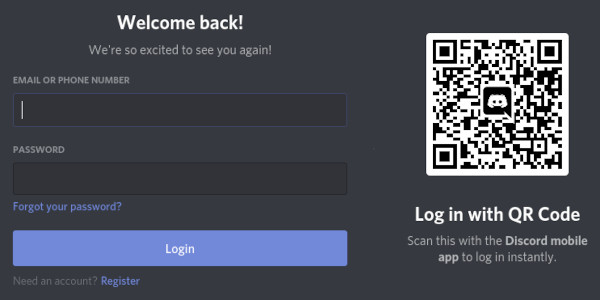
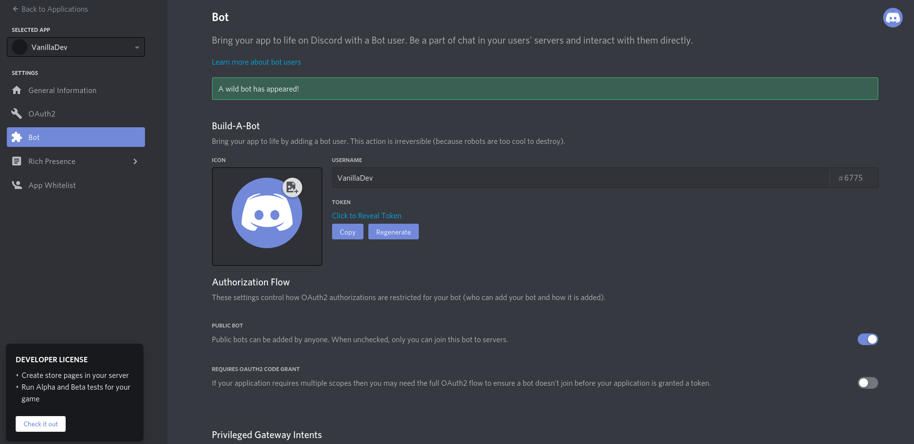
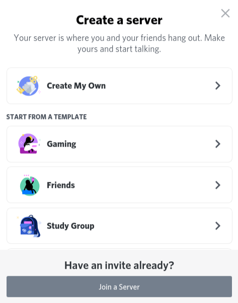
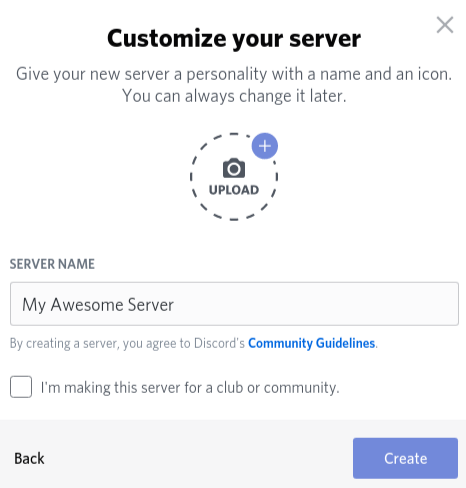

# Contributing

Follow this guide if you wish to help with the development of this community project.

## Purpose

Any community on Discord could use a little help managing the day to day activities and delivering to its user the best possible experience.

There's a lot of bots available out there, but carelessly adding bots to gather all the features we like might be cumbersome and add too much overhead.

This project aims to reduce this overhead developing a bot for the community and with the community.

## Get ready

To contribute to the code you'll need to:

- Setup your local machine
- Create for free a Discord developer account
- Get a token for your development bot
- Create a Discord server, for testing purposes
- Invite the bot to your server

All of this will be explained step-by-step.

## Local machine setup

If you made this far you most likely know the drill:

1. Install the latest [Node.js](https://nodejs.org/en/) LTS (using [nvm](https://github.com/nvm-sh/nvm) or similar library is highly recommended).

1. Clone this repository

1. Execute `npm install`

## Discord developer account (free)

Here's a walkthrough to get up and running with Discord:

1. Sign up or login to [Discord Developer Portal](https://discord.com/developers/applications), you can also use the QR code provided for logging in via mobile app.
   

1. In the dashboard, click _New Application_ on the top right.
   

1. Specify a name for your application (e.g. VanillaDev) and click _Create_.
   

1. This is how your app overview looks like, **do not share client secret** under any circumstance.
   

1. Navigate to the _Bot_ section, then click _Add Bot_.
   

1. This is how your bot overview looks like, **do not share token** under any circumstance.
   

For further information please refer to the [official Discord documentation](https://discord.com/developers/docs/intro).

## Bot token

For local development you need to provide your bot token as follows:

1. Open your browser.

1. Navigate to your dashboard on [Discord Developer Portal](https://discord.com/developers/applications/).

1. Select the application you created.

1. Navigate to the *Bot* section.

1. Click *Copy* underneath *TOKEN*.  
   

1. Open your IDE or editor of choice (e.g. [Visual Studio Code](https://code.visualstudio.com/)).

1. Open the folder where you cloned this repository.

1. Create in the root folder a file called `.env`.

1. Open the file `.env`.

1. Add a single line without spaces pasting the token you copied like this:
```
ITALIAJS_BOT_TOKEN=PASTE_HERE_YOUR_TOKEN
```

## Running your bot

To run your bot for development:

1. Open a terminal.

1. Navigate to the folder where you cloned this repository.

1. Execute `npm run dev`.

## Discord server creation

To create a Discord server follow these steps:

1. Open your Discord client.

1. Click the `+` icon in the bottom left.

1. Click the option *Create My Own*.  
   

1. Customize your server adding a name and optionally an avatar.  
   


